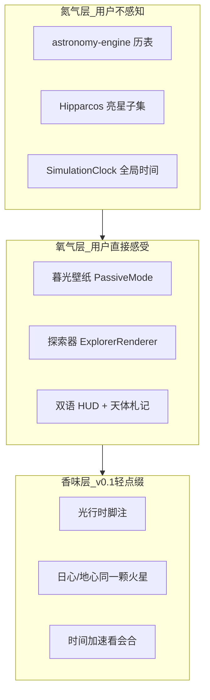
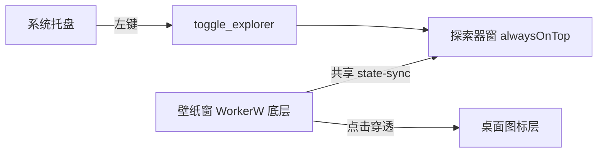
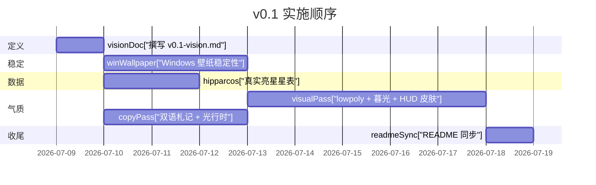

# Starmap Desktop v0.1 产品愿景

> **已演进**：v0.2 起项目重构为 [Sidereal Desk（恒星时桌面仪）](v0.2-sidereal-desk.md)，本文档保留作历史参考。

> 版本：0.1 · 平台：Windows · 语言：中英双语  
> 本文档是 v0.1 的「宪法」——指导文案、视觉、功能取舍。

---

## 1. 前言

### 为何存在

大多数人不会打开 Stellarium，却会在深夜瞥一眼窗外的天色。Starmap Desktop 想占据那个间隙：**一台放在桌面上的天文仪**——不教你天文学，却让你在日常使用电脑时，偶尔感到尺度、参照系与光的迟滞。

### 为谁存在

- 喜欢安静桌面、愿意让壁纸「有点意思」的人
- 对星空好奇，但不想被教程和菜单淹没的人
- 愿意拖动时间、切换视角，在无人讲解的情况下自己「啊哈」一下的人

### 不是什么

- 不是科研级星图软件
- 不是 Outer Wilds 式的叙事太空游戏
- 不是随机粒子特效的「太空玩具」
- 不是照片壁纸引擎

---

## 2. 产品灵魂

### 一句话

**Starmap Desktop 是一台放在你桌面上的天文仪（Observatory Instrument）**——底层用真实历表呼吸，表层用暮光、铜版星图与 lowpoly 几何呈现；你不学天文学，却在拖动时间、切换视角时自然感到尺度、参照系与光的迟滞。

### 对标交集

**1900 年代天文刊物 × 城市暮光 × 现代 lowpoly 探索游戏**

不是 Stellarium，不是 Wallpaper Engine，不是 Outer Wilds——而是三者的气质交集。

### 核心隐喻：「空气里的氮气」

| 层 | 用户感受 | 技术现实 |
|---|---|---|
| **氮气层**（不可见） | 一切「刚好是对的」 | `astronomy-engine` 历表、LST、日心坐标、Hipparcos 亮星 |
| **氧气层**（可呼吸） | 轻松、好看、想多停一会 | lowpoly 行星、刻线轨道、暮光壁纸、双语短注 |
| **香味层**（偶发） | 「咦，原来如此」 | 光行时脚注、参照系切换、时间加速下的会合周期 |

**原则**：不宣传「精确模拟」，也不做「太空玩具」。精确是地基，趣味是立面；思考由**软件行为本身**诱发，而非题库式科普。

差异句：**「我们不做最真的星图，我们做最愿意一直开着的星图。」**



---

## 3. 体验支柱

v0.1 只打磨三条支柱，不堆功能。

### 3.1 双窗格：壁纸与探索器



| 窗口 | 角色 | 帧率 | 交互 |
|---|---|---|---|
| **壁纸窗** | 城市暮光天空，太阳高度与观测地同步 | 0–1 FPS | 无（穿透） |
| **探索器窗** | 太阳系鸟瞰 / 本地星空穹顶 | 30–60 FPS | 拖拽、滚轮、时间控制 |

**唯一官方入口**：系统托盘左键切换探索器；右键菜单提供设置与退出。废弃全局快捷键叙事。

关键文件：
- [`src/WallpaperApp.tsx`](../src/WallpaperApp.tsx) + [`src/renderer/modes/PassiveMode.ts`](../src/renderer/modes/PassiveMode.ts)
- [`src/ExplorerApp.tsx`](../src/ExplorerApp.tsx) + [`src/renderer/ExplorerRenderer.ts`](../src/renderer/ExplorerRenderer.ts)
- [`src/main.tsx`](../src/main.tsx)（`?window=wallpaper|explorer` 分流）

### 3.2 时间作为第一乐器

仿真时间是 v0.1 最核心的「玩法」——没有任务、没有成就，只有时间。

- **暂停** / **实时** / **加速**（1× → 1 天/秒）
- 加速时内行星反复赶超外行星 → **会合周期**无需教程即可感知
- 壁纸与探索器通过 `state-sync` 共享同一时刻

关键文件：[`src/core/SimulationClock.ts`](../src/core/SimulationClock.ts)、[`src/ui/TimeControls.tsx`](../src/ui/TimeControls.tsx)

### 3.3 参照系切换 = 思考触发器

| 模式 | 参照系 | 镜头语言 |
|---|---|---|
| **太阳系** | 日心 | 鸟瞰刻线轨道，飞往目标行星 |
| **本地星空** | 地心 | 穹顶星空，天体沿地平线升起 |

**无声一课**：同一时刻、同一颗火星，在两视图中的位置与意义完全不同——这不是 bug，是参照系。

关键文件：[`src/renderer/modes/SolarSystemMode.ts`](../src/renderer/modes/SolarSystemMode.ts)、[`src/renderer/modes/LocalSkyMode.ts`](../src/renderer/modes/LocalSkyMode.ts)

---

## 4. 美学规范

### 气质关键词

| 关键词 | 含义 | 避免 |
|---|---|---|
| **Antiquarian Sci** | 铜绿、靛蓝、烫金细线；1900 年代天文刊物插图感 | 蒸汽朋克齿轮、维多利亚 cosplay |
| **Urban Twilight** | 壁纸是「窗外暮色」，非纯黑深空 | 霓虹赛博、抽象故障噪声 |
| **Lowpoly Candor** | 分色低多边形 + 刻线轨道；坦诚这是地图 | NASA 贴图、写实渲染 |

### 色彩

- 背景：深靛蓝 `#060a18` → 暮光紫 `#1a1428`
- 强调：烫金 `#f0c878`、铜绿 `#5a8a7a`
- 星点：暖白 / 冷白分色，非统一纯白
- 轨道：各行星色 + 低透明度刻线

### 字体

- **札记**（天体描述）：衬线——霞鹜文楷 / 思源宋体 fallback
- **控件**（按钮、标签）：无衬线——Segoe UI / system-ui
- **专名**：Latin/English 保留（Mars, AU, LST）

### 文案语气

**Before**（教科书）：
> 最内侧行星，无大气，温差极大。

**After**（v0.1）：
> 距太阳最近的旅客。白昼四百度，夜里零下两百度——大气稀薄到无法替你缓冲任何一端。  
> *Light from the Sun reaches here in ~3.2 min.*

每条：1–2 句中文 + 可选英文脚注；数据（AU、半径、周期）退居次要排版。

### 几何规范

- 行星：IcosahedronGeometry（lowpoly），分色 MeshBasicMaterial
- 土星环：扁平 RingGeometry，半透明
- 轨道：真实历表采样曲线，LineBasicMaterial 刻线
- 太阳：低多边形 + 柔和光晕（非粒子爆发）

---

## 5. 思考如何发生

v0.1 **不设问答题、不做科普弹窗**。以下「啊哈时刻」由软件行为自然触发：

1. **会合周期**：时间加速到 1 天/秒，看水星一次次超过火星——轨道速度不是均匀的常识被打破
2. **同一颗火星**：太阳系里它在日心坐标某处；切到本地星空，它在你城市地平线的另一方位——参照系不是抽象概念
3. **光的迟滞**：选中木星，脚注显示「此刻的光，约 35 分钟前从木星出发」——你看的不是「现在」
4. **暮光壁纸**：太阳高度 -6° 时天空仍有余晖，与真实日落同步——你和软件在同一时刻
5. **尺度假设**：角落小字「轨道间距已压缩以便阅读」——诚实比逼真更重要
6. **地方恒星时**：拖动时间，星空旋转速度与你所在经度相关——地球在转，不是天球在转

---

## 6. 软科幻边界

### v0.1 做（文案/标注层）

- **光行时脚注**：HUD 显示光从目标天体到地球的延迟
- **尺度假设声明**：太阳系视图角落标注压缩比例
- **文学化旁注**：「关于」或随机札记中出现相对论/量子意象——如「若在此处以近光速回望地球，城市灯火会怎样拉伸？」

### v0.1 不做（机制层）

- 相对论渲染（尺缩、钟慢、引力透镜）
- 量子效应模拟
- 虫洞、超光速旅行
- 任何影响历表准确性的「科幻修正」

**原则**：科幻是调味料，天文历表是主菜。

---

## 7. v0.1 功能清单

### In Scope（必须交付）

| 模块 | v0.1 目标 |
|---|---|
| Windows 壁纸附着 | 稳定无闪烁、无意外置顶、切应用后不跑偏 |
| 双窗口 + 状态同步 | 文档化 + 边界测试 |
| 太阳系 + 本地星空 | 视觉打磨、lowpoly 行星 |
| 仿真时间 | 暂停/实时/加速档位 |
| 亮星星表 | Hipparcos 真实亮星子集（~500–1000，Vmag < 6.5） |
| 中英双语 UI | HUD、设置、托盘、札记 |
| 产品文档 | 本文档 + README 同步 |

### Out of Scope（非目标）

- macOS / Linux 壁纸层
- 银河系 / 星系视角
- Steam / Workshop
- 粒子特效玩具化系统
- 相对论/量子力学模拟机制
- 世界地图 passive 模式
- 在线天文台、UGC、社交

### Nice-to-have（有余力再做）

- 行星点击选中 + 3D 标签
- 开机自启
- 极简环境音

---

## 8. 技术映射

```
src/
├── main.tsx                    # 双窗口入口分流
├── WallpaperApp.tsx            # 壁纸窗 React 壳
├── ExplorerApp.tsx             # 探索器 React 壳
├── core/
│   └── SimulationClock.ts      # 全局仿真时间
├── store/
│   ├── useAppStore.ts          # Zustand 状态
│   ├── stateSync.ts            # 双窗口同步
│   └── persistence.ts          # 设置持久化
├── data/
│   └── bodyCatalog.ts          # 天体元数据 + 札记文案
├── astronomy/
│   ├── engine.ts               # astronomy-engine 封装
│   ├── solarSystem.ts          # 日心坐标 / 轨道采样
│   ├── stars.ts                # 星表加载与渲染
│   └── lightDelay.ts           # 光行时计算
├── renderer/
│   ├── WallpaperRenderer.ts    # 壁纸渲染循环
│   ├── ExplorerRenderer.ts     # 探索器渲染循环
│   ├── celestial/
│   │   ├── SkyDome.ts          # 暮光天空 shader
│   │   ├── FlyCamera.ts        # 飞往目标
│   │   └── lowpoly.ts          # lowpoly 行星几何
│   └── modes/
│       ├── PassiveMode.ts      # 壁纸暮光
│       ├── SolarSystemMode.ts  # 太阳系鸟瞰
│       └── LocalSkyMode.ts     # 本地星空穹顶
└── ui/
    ├── HUD.tsx                 # 探索器面板
    ├── TimeControls.tsx        # 时间控制栏
    ├── PassiveOverlay.tsx      # 壁纸信息层
    └── SettingsPanel.tsx       # 设置

src-tauri/src/
└── lib.rs                      # attach_wallpaper / show_explorer / 托盘

public/assets/stars/
└── hipparcos.json              # 生成自 scripts/generate-stars.mjs
```

---

## 9. 里程碑与成功标准

### 实施顺序



| 阶段 | 内容 |
|---|---|
| W0 | 发布本文档 |
| W1 | Windows 稳定性 + 真实星表 |
| W2 | 视觉系统（lowpoly、暮光、HUD） |
| W3 | 文案 + 光行时脚注 |
| W4 | README 同步、试玩、回归 |

### 验收标准

- [ ] 无需说明书：托盘 → 探索器 → 太阳系 → 加速时间 → 切换本地星空
- [ ] 壁纸 24h 开着：不抢焦点、不闪烁、切应用后不跑偏
- [ ] 行星位置与 Stellarium 视觉可接受（「视觉正确」非科研级）
- [ ] 文案像「深夜翻旧天文杂志」，非 Wikipedia
- [ ] 全程中英双语可并列显示
- [ ] 托盘唤起探索器 < 500ms
- [ ] 1 天/秒加速下轨道动画流畅

---

## 10. 开放问题（v0.2+）

- **银河系视角**：是否以「离开太阳系」的过渡镜头呈现，而非独立模式？
- **环境音**：城市暮光底噪 vs 深空寂静——默认静音还是极简音频？
- **macOS 壁纸层**：NSWindow 层级方案 vs 独立显示器模式
- **行星点击选中**：射线拾取 + 浮动标签
- **Workshop / 内容包**：用户自定义星图风格是否值得做？
- **相对论彩蛋**：纯文案 vs 轻量视觉（如近光速时星场蓝移）？

---

*Starmap Desktop v0.1 — 一台你愿意一直开着的星图。*
